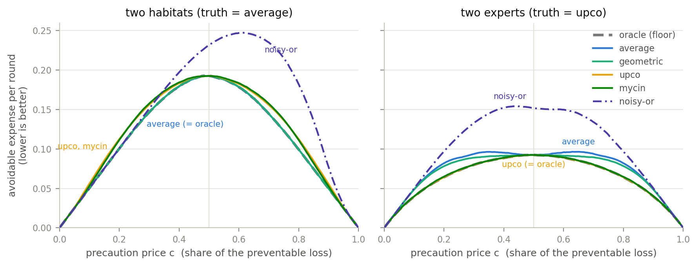

# Pooling ↔ Monte-Carlo correspondence suite

Small, self-contained Monte-Carlo experiments about **combining two probability-like
estimates into one** — the operation variously called opinion pooling, evidence combination,
or confidence combination. Many combination formulas are in use (average, max, noisy-or,
product of experts, MYCIN certainty factors, the ProbLog conflict rule, Dempster–Shafer,
log-odds pools…), and they disagree strongly on the same inputs: two reports of 0.3 and 0.8
combine to 0.55, 0.63, 0.80, 0.86 or other values depending on the rule. The suite answers two
questions experimentally:

1. **Correspondence** (`corr_*.py`): for each formula, a fully specified random situation —
   habitats, experts, camera traps, witnesses — whose outcome frequency the formula reproduces
   exactly. Choosing a combination rule is a claim about how the two sources relate; each
   experiment states one such claim and verifies it by simulation.
2. **Decision value** (`decide_*.py`): what using the wrong formula costs, measured in money.
   A bettor pools the two reports and splits her stake (Kelly betting); a keeper pools them
   and decides on a costly precaution (cost-loss decisions). Each rule has a betting world
   where it earns the most; mismatched rules pay a measurable price and can lose outright.

Everything is deliberately small: plain Python, fixed seeds, one story per file, and every
script prints the claim it makes together with the simulated check of that claim.

## How to run

```
python3 run_all.py
```

runs all 14 sections in about a minute. Requirements: Python 3 only — except section 14
(the Murphy diagram figure), which needs `numpy` and `matplotlib` and is skipped with a
notice if they are missing. Every script is also runnable on its own
(`python3 corr_upco_bayes.py`) and importable (each has a `main()`).

**What to expect.** Each section prints a short story, the Monte-Carlo frequencies next to
the formula values (`match` / `best=...` lines), and for the betting sections a ranking of
rules by wealth growth with the predicted winner checked (`-- as predicted`; a failed check
prints `UNEXPECTED`). Seeds are fixed, so the numbers are reproducible run-to-run. The Murphy
diagram section writes `murphy_diagram.pdf/.png` into this folder.

## Two scales

- **Probability-scale opinion pools** — inputs are probabilities / calibrated credences in
  `[0,1]`: averaging, max, noisy-or, upco, geometric.
- **Confidence combinators** — inputs are confidences, `0.5 = "no information"`, internally
  a signed evidence strength `s = 2·conf − 1`: problog, mycin. Their correspondence is
  on the strength scale (`s` = probability that an independent proof of that polarity
  exists). noisy-or is the bridge: it is both the independent-OR probability pool and the
  agreement case of problog/mycin on strengths.

**Which MYCIN rule.** `poolib.mycin` implements the revised MYCIN certainty-factor
combination — the version introduced with van Melle's EMYCIN and documented in Buchanan &
Shortliffe, *Rule-Based Expert Systems* (1984): on signed strengths, agreement combines as
`x + y − xy` and conflict as `(x + y) / (1 − min(|x|, |y|))`. The original 1975 rule
(Shortliffe & Buchanan, *Math. Biosciences* 23) added opposite-sign factors without the
renormalizing denominator; that older variant is not used here.

## The correspondence map

| function | file | generative situation it matches | status |
|---|---|---|---|
| **averaging** (linear) | `corr_averaging_mixture.py` | latent mixture: one randomly chosen source (weight wᵢ) governs the case → `Σ wᵢ pᵢ` | exact ✓ |
| **max** | `corr_max_dependent_or.py` | at least one of two overlapping / redundant detectors fires → `max(p,q)` (= cumulation's fully-dependent endpoint) | exact ✓ |
| **problog / noisy-or** | `corr_problog_independent_or.py`, `corr_max_dependent_or.py` | independent evidence: agreement = `a+b−ab` (independent OR); conflict = `a(1−b)` (for ∧ ¬against) | exact ✓ |
| **upco** / multiplicative / product-of-experts | `corr_upco_bayes.py` | Bayes posterior over two conditionally-independent experts at prior ½; off ½ the prior-corrected odds pool matches | exact ✓ |
| **geometric** / log-linear | `corr_geometric_shared_evidence.py` | two agents sharing / averaging the same evidence: geo-pool of posteriors = posterior on averaged sample | exact ✓ (posterior-level) |
| **mycin** (revised CF rule) | `corr_mycin_probe.py` | agreement = noisy-or (clean frequency); conflict `(a−b)/(1−b)` = the probability that a claim survives one-on-one refutation (each against-sign kills one for-sign; part D) — under independent opposing evidence no natural count gives it (parts C-a/C-b2) | agreement ✓; conflict ✓ under refutation coupling (marginals calibrated); independent-conflict = negative result |
| **cumulation** (max ↔ noisy-or) | `corr_cumulation_dependence_spectrum.py` | combining two proofs of one fact by how dependent they are: shared evidence → `max`, independent → noisy-or; `cumul = max + a·(noisy-or − max)` | endpoints exact ✓; middle is a heuristic |
| **Dempster–Shafer** (bel / pl / pignistic) | `corr_dempster_shafer.py` | two contradicting witnesses of known reliabilities `m1, m2` who cannot both be reliable (both-reliable rounds redrawn = Dempster renormalization): `bel = m1(1−m2)/(1−m1m2)` = forced-true count, `pl` = not-excluded count, pignistic BetP = coin-resolved count (Smets: bet with BetP). Agreement case = noisy-or. Conflict rule lineup: naive < problog < DS-bel ~ mycin < BetP | exact ✓ (all three counts) |
| **weighted / extremized log-odds** (`w1·l1 + w2·l2`) | `decide_extremized_weighted_logodds.py` | reports with distorted log-odds: uniform distortion `k` → symmetric `α = 1/k` exact (α=2 = tournament "extremizing" for timid reports); per-expert `k_i` → weights `1/k_i` exact; shared evidence → best α strictly between ½ and 1 but not exact (irreducible gap — the one-knob limitation). Weighted linear pool ↔ mixture with unequal situation probabilities (weights = those probabilities) | distortion cases exact ✓; shared-evidence case = best-in-family only |

## Key takeaways

- Each pooling rule is Bayes-/frequency-optimal under its own generative assumption; there
  is no single "correct" pool. Dependence structure decides between max (fully dependent) ↔
  noisy-or/problog (independent); the prior decides whether upco (½) or the prior-corrected
  odds pool (any prior) is right; shared-vs-independent evidence decides between geometric and
  upco.
- mycin: the conflict renormalization has a clean algebraic reading — opposing evidence
  cancels rate-for-rate (`λ = −ln(1−x)`) — and an exact frequency reading under one-on-one
  refutation (below), but it is not the frequency of independent opposing observations.
  Its practical value is associativity / order-independence and bias-robustness. For
  disagreeing calibrated experts, the correct pooled posterior is upco / the prior-corrected
  odds pool.

## The rate-cancellation reading of the MYCIN conflict rule

Give each piece of evidence an additive "rate" `λ = −ln(1−x)` — the standard weight of a
noisy-or / independent-hit (Poisson) process, so that `x = 1 − e^{−λ}` is the probability that at
least one hit occurs. Then the MYCIN conflict rule is exactly

```
    (a − b)/(1 − b)  =  1 − e^{−(λ_a − λ_b)}          (a > b),   λ_a = −ln(1−a), λ_b = −ln(1−b)
```

i.e. the "against" evidence cancels the "for" evidence rate-for-rate, and the surviving net
rate `λ_a − λ_b` gives the resulting confidence via noisy-or. (`corr_mycin_probe.py`,
Part B, verifies the identity numerically; the agreement case is the same picture with rates
adding, `λ_a + λ_b`.) The `1/(1−min)` denominator is precisely "renormalize over the
surviving, uncancelled rate", and the rate `λ = −ln(1−x)` is the additive generator of the
known uninorm representation of the rule (De Baets & Fodor 1999) made concrete as evidence
rates.

The identity is realizable as a frequency — but only under a specific coupling
(probe part D). Under independent for/against processes no natural count gives it (the two
obvious joint models — independent net-count `pro − con ≥ 1`, and independent
`pro ∧ ¬con = a(1−b)` — do not match; probe parts C-a/C-b2). But if every against-sign refutes
one specific for-sign (the against-process is a thinned subset of the for-process), the
surviving for-signs form a Poisson process of rate `λ_a − λ_b`, so
P(the claim survives) = `(a−b)/(1−b)` exactly, with both observers' marginal report rates
still calibrated (`a` and `b`). So the conflict split mirrors the agreement split: independent
evidence → problog `a(1−b)`; completely coupled (one-on-one refutation) evidence → mycin — just
as independent triggers → noisy-or and redundant triggers → max. One caveat: the event is "the
claim survives scrutiny" (an evidence-level event), not the underlying fact itself; for
calibrated experts reporting about the fact, the right pool remains upco / the odds pool.
Betting demonstration: `decide_kelly_scenarios.py`, worlds 6 vs 7.

## Cumulation: the max-to-noisy-or spectrum

`corr_cumulation_dependence_spectrum.py` studies the idea (from the CONFER confidence
framework for automated reasoning, CADE 2021) that two proofs of the same fact are combined by
`cumul(c1,c2,a) = max(c1,c2) + a*(noisy-or - max)`: `a=0` gives max (the two proofs share all
their evidence), `a=1` gives noisy-or (independent proofs).

Three experiments:

1. **Common-shock model** — the exact condition. With probability `lam` the two proofs share
   one random draw (giving max), otherwise they draw independently (giving noisy-or). The union
   rate is then `lam*max + (1-lam)*noisy-or = cumul(c1,c2, a=1-lam)`, matched by Monte-Carlo.
   So `cumul` is exactly right when the dependence is this mixture, and `a` is the fraction
   of the time the two proofs are independent.

2. **Shared-inputs model.** Two proofs each need `m` evidence items (each valid with
   probability `q`); the proofs share `k` items. With `k=0` the proofs are independent
   (noisy-or); with `k=m` they are identical (max). The two endpoints match exactly; in the
   middle the linear rule slightly overestimates the union rate, so `cumul` is a reasonable
   heuristic there, not an identity.

3. **Full dependence range.** For fixed marginals `c1, c2`, `P(A or B)` is not fixed — it
   ranges over `[max(c1,c2), min(1, c1+c2)]` (the Fréchet bounds). max = maximal positive
   dependence, noisy-or = independence, `min(1,c1+c2)` = maximal negative dependence.
   Cumulation's `[max, noisy-or]` is the positive-dependence-to-independence half; two proofs
   of the same fact never need the other half.

Literature context: max and the probabilistic sum are the two classical t-conorms and
parametric families interpolate between them (Klement, Mesiar & Pap, *Triangular Norms*,
2000); the position of `P(A or B)` between the Fréchet bounds is set by the copula joining the
two events (Nelsen, *An Introduction to Copulas*); the interval `[max, min(1,sum)]` for a
disjunction under unknown dependence is the classical Boole–Fréchet–Hailperin
probabilistic-satisfiability result. Cumulation is a heuristic one-parameter interpolation
across the positive-dependence half of that range, exact in the common-shock model.

## Decision-value experiments: what the wrong pool costs

`decide_kelly_betting.py` and `decide_cost_loss.py` add the third participant: a decision maker
receives the two observers' reports, pools them with a candidate rule, and then acts — bets
money, or takes a costly precaution. Pooling rules are compared by realized payoff, not by
inspecting the pooled number.

The measurement machinery is standard:
- **Kelly betting / log-optimal growth** — Kelly, Bell Syst. Tech. J. 35:917–926, 1956;
  Cover & Thomas, *Elements of Information Theory*, ch. 6: betting proportionally to `q` at
  fair odds when the truth is `p` loses growth rate exactly `KL(p‖q)`. "Money won" is the log
  score in wealth form (Roulston & Smith, Mon. Wea. Rev. 130:1653–1660, 2002; the "weather
  roulette" of Hagedorn & Smith, Met. Apps 16:143–155, 2009).
- **Cost-loss decision value** — Murphy, Mon. Wea. Rev. 105:803–816, 1977; Richardson, QJRMS
  126:649–668, 2000 (act iff `q > C/L`; value across the C/L range).
- **The bridge** — Schervish, Ann. Stat. 17:1856–1879, 1989: every proper scoring rule is a
  mixture of two-action cost-loss problems over thresholds (Brier = flat mixture; log score =
  density ∝ 1/(c(1−c))). Modern form: Ehm, Gneiting, Jordan, Krüger, JRSS-B 78:505–562, 2016
  ("Murphy diagrams"). So "average payoff over a spread of stakes" is a proper score —
  accuracy at the single threshold ½ is just one degenerate slice of it.
- **Forecast-combination evaluation** — Ranjan & Gneiting, JRSS-B 72:71–91, 2010; Satopää et
  al., IJF 30:344–356, 2014; Baron et al., Decision Analysis 11:133–145, 2014; Jose,
  Grushka-Cockayne & Lichtendahl, Mgmt. Sci. 60:463–475, 2014. All evaluate by proper scores.
  To our knowledge, no prior work compares pooling formulas head-to-head by Kelly wealth or
  cost-loss value (nearest: Grant & Johnstone, IJF 26:498–510, 2010).

What the experiments show:
- `decide_cost_loss.py` part 0 proves the fact that dooms accuracy-based comparisons: at
  the even threshold ½, avg, geometric, upco and mycin all make the same decision — each
  exceeds ½ exactly when `p1+p2 ≥ 1` (verified on a 9702-point grid; noisy-or and max genuinely
  differ). Counting correct guesses at even stakes cannot distinguish the four opinion pools.
- Differences appear exactly where the literature says: through bet sizing (Kelly) and
  uneven stakes (cost-loss at C/L ≠ ½). In the separate-experts world the upco bettor
  matches the oracle and the avg bettor gives up ≈0.09 bits/round; in the mixture world the avg
  bettor is the oracle and the upco/mycin bettors lose money in absolute terms (negative
  growth) while the informed bettor profits. The cost-loss tables show the same pattern as
  expense: the situation-matched pool sits on the oracle floor at every stake level, ties
  at ½, and the others pay extra at the outer ratios.
- Together: the pragmatic value of a pooling rule = how closely it tracks the true conditional
  probability of the situation, priced either as wealth growth (gap = KL) or expected expense
  (gap = Schervish mixture of threshold regrets). "Which pool should the third participant use"
  has the same answer as the correspondence map above — now measured in money.
- `decide_kelly_scenarios.py`: nine betting worlds, one per pooling function (avg, upco,
  geo, noisy-or, max, mycin, problog, cumulation, and Dempster–Shafer pignistic in the
  contradicting-witnesses world 9), each constructed so that its pool equals the world's true
  conditional probability and therefore wins the most money — verified: all nine predicted
  winners win. World 9 also prices the DS bounds: the bel-bettor under-bets and the
  pl-bettor over-bets, while problog and the naive difference rule lose money outright there.
- `decide_extremized_weighted_logodds.py` covers the weighted / extremized log-odds family:
  symmetric α sweep peaking exactly at 1 (calibrated, private evidence), ½ (fully shared), 2
  (timid reports — the exact version of tournament extremizing); a half-shared world where the
  best α is interior but no α reaches the oracle (gap ≈0.04 bits/round — the price of a
  one-knob rule); per-expert weights `1/kᵢ` matching the oracle under asymmetric distortion
  where every symmetric rule fails; and the weighted linear pool winning in an unequal
  mixture. Estimating the knob from past data (Cooke-style performance weighting) is not part
  of the suite. Notable: geo wins in the overconfident-experts world (each expert reports
  doubled log-odds; geometric pooling averages log-odds and undoes exactly that); mycin wins
  in the refutation world (part D above); the naive difference wins in neither conflict
  world. The even-odds choice is harmless: growth rankings are independent of the
  bookmaker's odds.
- `decide_murphy_diagram.py` draws the Murphy diagram (Ehm–Gneiting–Jordan–Krüger 2016):
  the keeper's avoidable expense (spending beyond perfect foresight: a wasted precaution
  burns c, an unprotected event costs 1−c extra; lower is better) at every cost ratio c at
  once, one curve per rule, for the habitats world (truth = avg) and the experts world (truth
  = upco). The oracle curve is the floor, the situation-matched rule lies on it, the four
  rules above (avg/geo/upco/mycin) meet in one point at c = ½ and fan apart toward the
  extreme ratios; noisy-or misses the common point. The script also verifies the Schervish
  identity numerically: the expense-gap curve integrated with weight dc/(c(1−c)) reproduces
  each rule's Kelly betting gap to four decimals — the betting number and the cost-loss
  numbers are one object read two ways.

  
- `decide_kelly_unknown_world.py` drops the assumption that the bettor knows her world: the
  world is one of the known ones, all equally likely, and she must pick one rule for good.
  Two versions — world fixed for the whole series vs redrawn every round — give the same
  expected growth for any fixed rule (verified; both equal the average of the per-world
  growth rates); they differ in risk and in what is achievable. Only worlds sharing a report
  interface can be mixed: group A = the six both-numbers-support worlds (avg, upco, geo,
  noisy-or, max, cumul), group B = the three for/against worlds (mycin, problog, DS); all
  group-A worlds draw their two numbers from one common distribution so the numbers do not
  betray the world. Results: the average of the world truth formulas ("mixworld") wins both
  groups — the unknown-world problem is itself a mixture, so the mixture logic (averaging)
  applies one level up, over formulas instead of reports. In group A the safe single rules are
  geo and avg (positive growth in every world); max earns more on average but loses in two
  worlds; noisy-or is best-or-terrible. In group B every single conflict rule loses money in
  some world (even pignistic, the world-9 winner, has negative mean growth), and mixworld is
  the only informative rule with positive growth in all three. Knowing the world is worth
  ≈0.04 (A) / ≈0.06 (B) bits per round over mixworld.

## Extending the suite

To add a new pooling rule, follow the pattern of any existing pair of files:

1. Add the formula to `poolib.py` (and to `POOLS` if it takes probability-scale inputs).
2. Write a `corr_<rule>_<situation>.py`: a docstring that tells the generative story in plain
   words, a simulation of that story, and printed lines comparing the Monte-Carlo frequency
   with the formula (`poolib.fmt_compare` helps for probability-scale rules).
3. Give the rule a betting world in `decide_kelly_scenarios.py` — a `world_*` generator whose
   per-round true probability *is* the rule's formula — and add the rule to the pool
   dictionaries there. If its report interface fits (both-numbers-support, or for/against),
   add the world to the lottery in `decide_kelly_unknown_world.py`.
4. Register the new script in `run_all.py`.

Conventions: fixed random seeds; each claim printed next to its simulated check; predicted
winners asserted in output (`as predicted` / `UNEXPECTED`); plain-language stories about
concrete observers rather than abstract notation.

## Files

- `poolib.py` — the pooling functions (avg, max, noisy-or, upco, geo, mycin, problog,
  cumulation, Dempster–Shafer, weighted log-odds) + odds / prior-corrected-Bayes helpers +
  comparison reporting.
- `corr_*.py` — one correspondence scenario each (table above).
- `decide_*.py` — the decision-value experiments (Kelly betting, betting worlds, cost-loss,
  Murphy diagram, unknown-world lotteries).
- `run_all.py` — runs everything.

## License

Apache License 2.0 — see [`LICENSE`](LICENSE).
